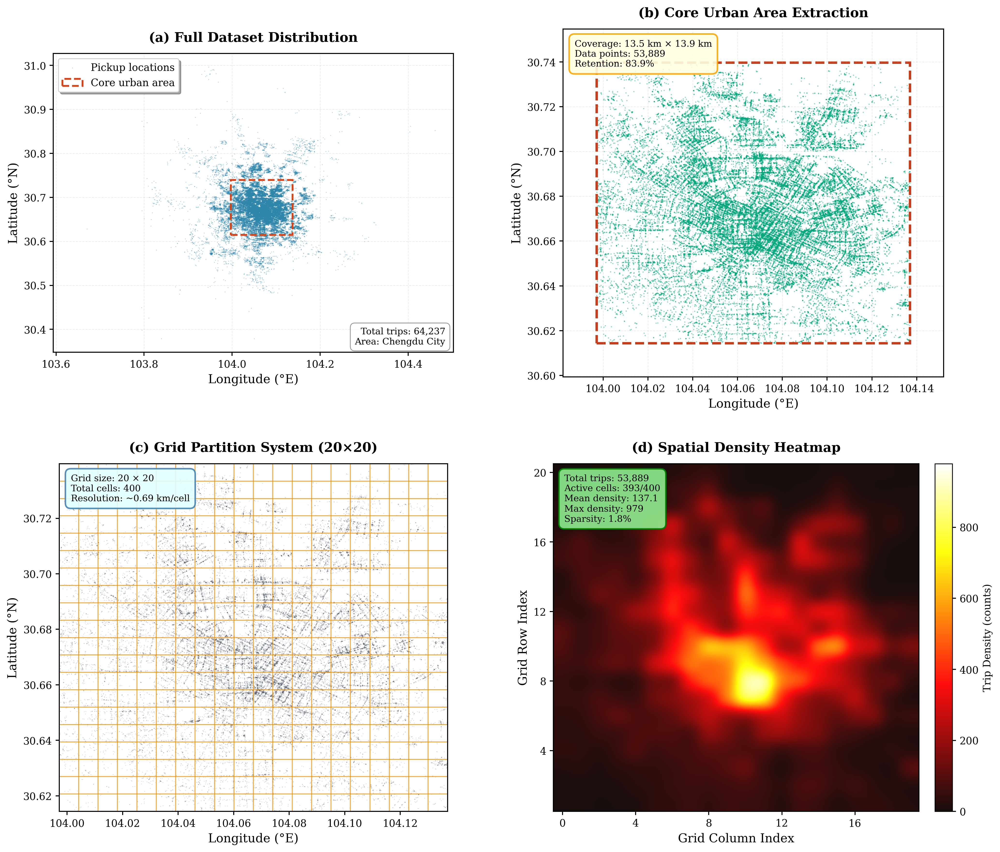
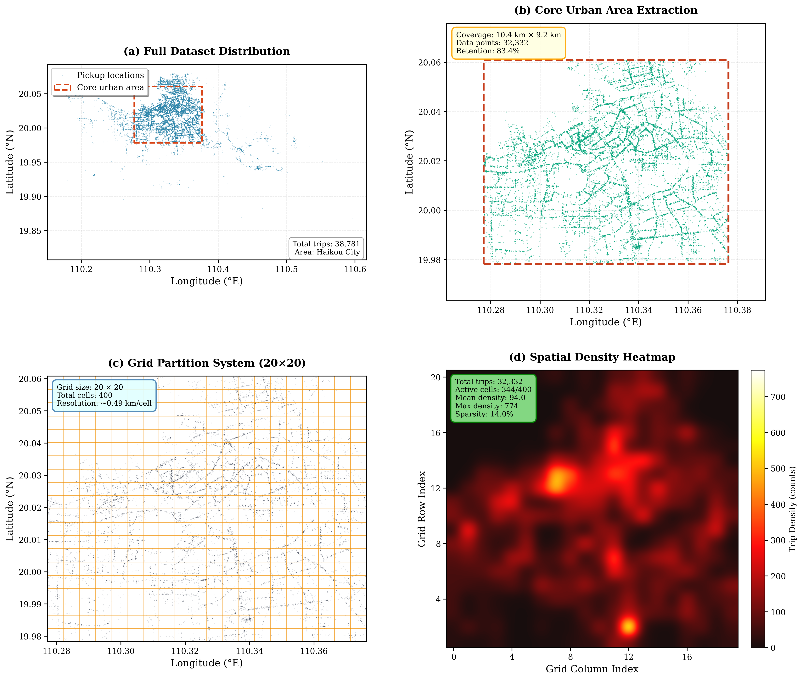

# M-STAR

Nisang Chen, Weixu Lu, Xuchu Jiang, and Biao Zhang

## Discription
M-STAR is a Multi-Scale Spatio-temporal Attention Refinement Network for short-term citywide taxi inflow–outflow prediction on grid-discretized urban networks.

## Dataset
We study two large-scale taxi OD datasets from Chengdu and Haikou, chosen to cover heterogeneous urban morphology and demand intensity.The region is partitioned into a $20\times20$ grid (400 cells), yielding cell sizes of approximately $0.68\,\text{km} \times 0.70\,\text{km}$ and $T_{\mathrm{Chengdu}}=1{,}440$ time steps.

## Methodology Structure

M-STAR employs a unified encoder--decoder pipeline that transforms raw grid-level origin--destination data into multi-step traffic forecasts. The architecture consists of four sequential components: (1) multi-source data embedding, which projects numerical, temporal, and spatial information into a shared latent space; (2) a hierarchical spatiotemporal encoder that refines representations through stacked blocks; (3) cross-layer skip connections for feature fusion; and (4) a prediction decoder that outputs future inflow--outflow trajectories.

### Multi-source data embedding

Multi-source data embedding serves as the input interface, mapping heterogeneous traffic data into a unified semantic space and producing the initial hidden tensor that will be processed by all subsequent encoder layers.

### Hierarchical spatiotemporal encoder

Hierarchical spatiotemporal encoder is the core of the model, stacking $L$ encoder blocks that progressively transform the embedded sequence. Within each block, four-branch heterogeneous attention, the multi-scale temporal refiner, and a feed-forward network cooperate to refine coarse spatiotemporal relations into fine-grained temporal patterns.

### Cross-layer skip connections
Cross-layer skip connections collect the outputs from different encoder layers and fuse them via weighted summation. This DenseNet-style design preserves multi-scale information by combining shallow, high-frequency features with deeper, low-frequency semantics, and provides a bridge between the encoder stack and the decoder.

### Prediction decoder
Prediction decoder finally maps the fused representation to the target space using lightweight convolutions that project along the temporal dimension ($T_{in} \rightarrow T_{out}$) and the feature dimension ($D \rightarrow C$), yielding the predicted inflow--outflow tensors.

## Results

### Prediction Visualization

## Conclusion
M-STAR integrates a four-branch heterogeneous attention module---covering temporal, geographic, semantic, and adaptive data-driven dependencies---with a multi-scale temporal refiner that combines multi-dilated convolutions, lightweight temporal attention, and cross-node temporal interactions. Cross-layer skip connections aggregate multi-level encoder representations, and grouped-query attention reduces key--value redundancy while preserving modeling capacity. Extensive experiments on two large-scale taxi origin--destination datasets from Chengdu and Haikou demonstrate that M-STAR consistently outperforms representative statistical baselines (ARIMA, VAR), generic sequence models (LSTM, GRU), grid-based CNNs (ST-ResNet), spatiotemporal GNNs (STGCN, ASTGCN, Graph WaveNet, MTGNN, GMAN, MoGERNN), and recent Transformer/MLP forecasters (PDFormer, STAEformer, TimeMixer) across MAE, RMSE, and MAPE, with especially pronounced gains on the sparser Haikou dataset.
