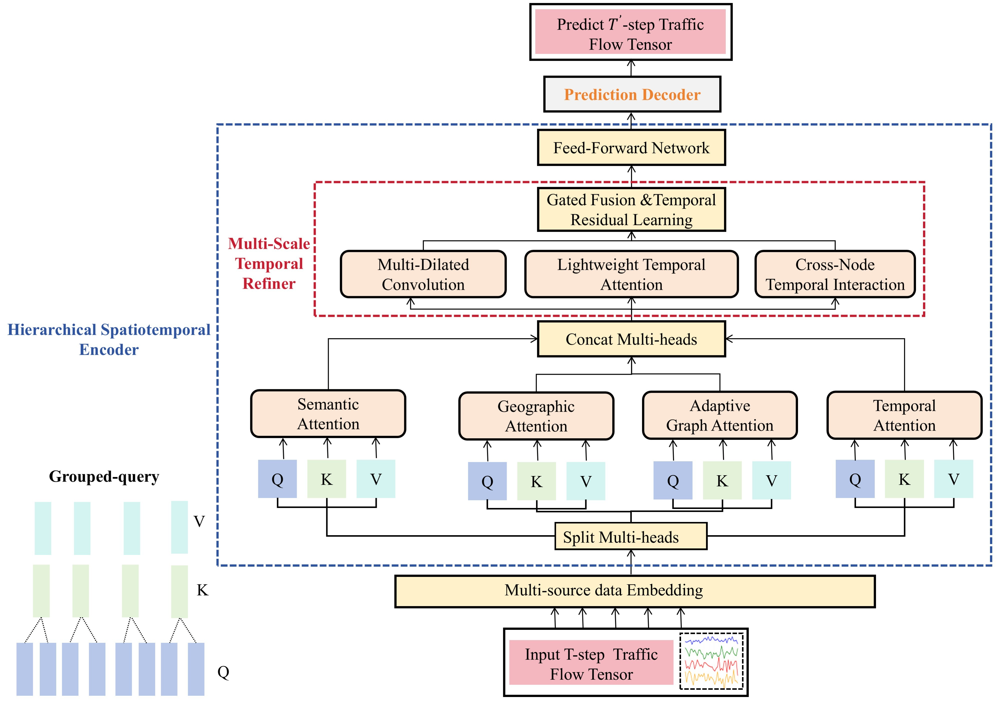
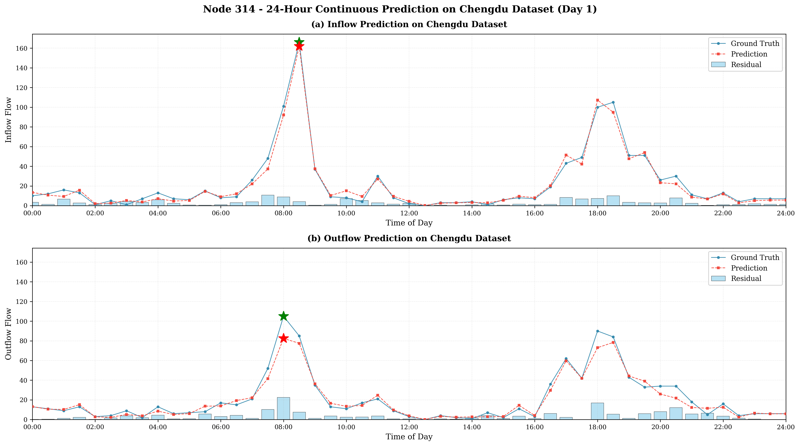

# M-STAR

Nisang Chen, Weixu Lu, Xuchu Jiang, and Biao Zhang

## Discription
M-STAR is a Multi-Scale Spatio-temporal Attention Refinement Network for short-term citywide taxi inflow–outflow prediction on grid-discretized urban networks.

## Dataset
We study two large-scale taxi OD datasets from Chengdu and Haikou, chosen to cover heterogeneous urban morphology and demand intensity.The region is partitioned into a $20\times20$ grid (400 cells), yielding cell sizes of approximately $0.68\,\text{km} \times 0.70\,\text{km}$ and $T_{\mathrm{Chengdu}}=1{,}440$ time steps.

## Methodology 

M-STAR employs a unified encoder--decoder pipeline that transforms raw grid-level origin--destination data into multi-step traffic forecasts. The architecture consists of four sequential components: (1) multi-source data embedding, which projects numerical, temporal, and spatial information into a shared latent space; (2) a hierarchical spatiotemporal encoder that refines representations through stacked blocks; (3) cross-layer skip connections for feature fusion; and (4) a prediction decoder that outputs future inflow--outflow trajectories.

## Structure

- **raw_data/**  
  - `ChengduDiDi20x20.geo/`: contains geographical features (e.g., roads, zones) for Chengdu DiDi spatial analysis used in this study 
  - `ChengduDiDi20x20.grid/`： contains raster file representing a 20×20 grid of numerical values (e.g., traffic density) across Chengdu for DiDi trip data used in this study
  - `config.json/`: a configuration file in JSON format that stores settings,

- **libcity/**  
  - **`config/`**
    - `data/`
    - `evaluator/`
    - `executor/`
    - `model/traffic_state_pred/`
  - **`data/`**
    - `dataset/`
    - `__init__.py/`
    - `batch.py/`
    - `list_dataset.py/`
    - `utils.py/`
  - **`evalator/`**
  - **`model/`**
  - **`pipeline/`**
  - **`utils/`**

## Results

### Prediction Visualization

## Conclusion
M-STAR integrates a four-branch heterogeneous attention module---covering temporal, geographic, semantic, and adaptive data-driven dependencies---with a multi-scale temporal refiner that combines multi-dilated convolutions, lightweight temporal attention, and cross-node temporal interactions. Cross-layer skip connections aggregate multi-level encoder representations, and grouped-query attention reduces key--value redundancy while preserving modeling capacity. Extensive experiments on two large-scale taxi origin--destination datasets from Chengdu and Haikou demonstrate that M-STAR consistently outperforms representative statistical baselines (ARIMA, VAR), generic sequence models (LSTM, GRU), grid-based CNNs (ST-ResNet), spatiotemporal GNNs (STGCN, ASTGCN, Graph WaveNet, MTGNN, GMAN, MoGERNN), and recent Transformer/MLP forecasters (PDFormer, STAEformer, TimeMixer) across MAE, RMSE, and MAPE, with especially pronounced gains on the sparser Haikou dataset.
